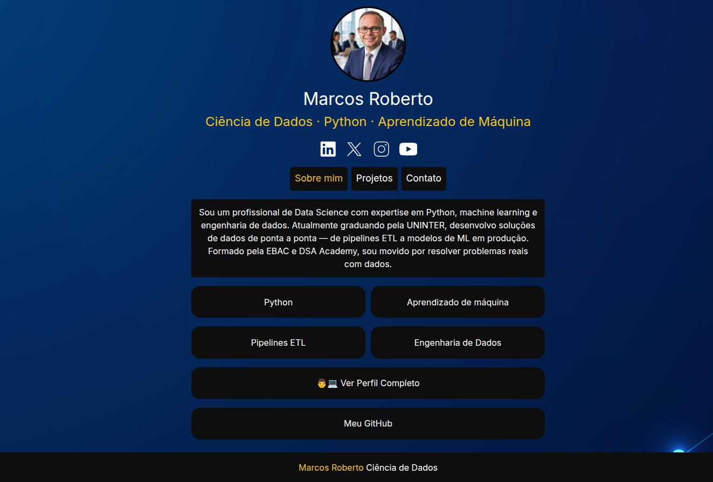

<p align="center">
  
</p>

[](https://dedicateddevexpert.github.io/DedicatedDevExpert/)

# Install

First, clone the file with the following command. Then apply the [component](https://github.com/ardacarofficial/links-website/wiki/Component-Settings "component") and [design](https://github.com/ardacarofficial/links-website/wiki/Design-Settings "design") settings. You can check the [wiki](https://github.com/ardacarofficial/links-website/wiki "wiki") for help.

```sh
git clone https://github.com/ardacarofficial/links-website.git
```

You can then upload your files to any hosting.

# Note

Contributions are what make the open source community a great place to learn, inspire and create. Your contributions are greatly appreciated.

If you have a suggestion to make this better, please fork the repository and create a pull request. You can also open an issue with the "Development" tag. If you want, you can also share it in the [discussions](https://github.com/ardacarofficial/links-website/discussions/ "discussions") section. Don't forget to give stars to the project!

# License

Distributed under the MIT license. See [LICENSE](https://github.com/ardacarofficial/links-website/blob/main/LICENSE "LICENSE") file for more information.
